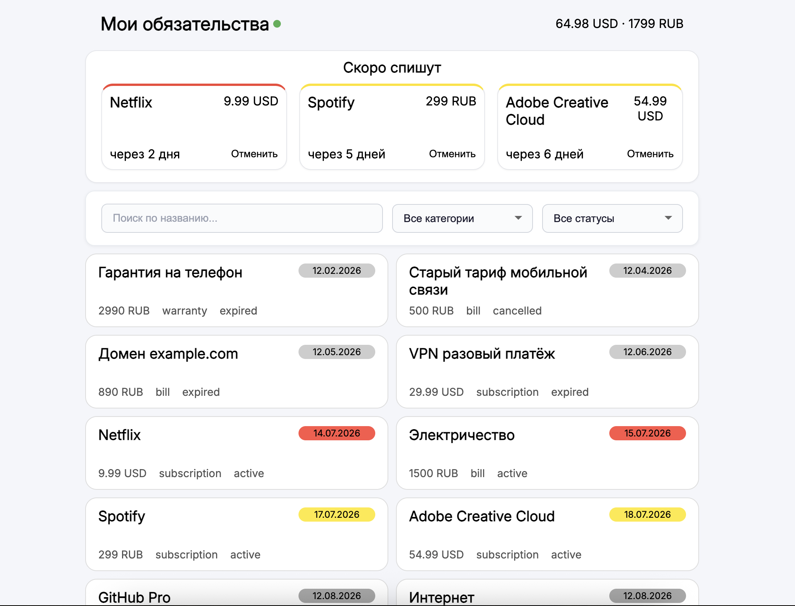

# sber_test_task

## Запуск проекта
1. Запускаете docker
2. Через консоль переходите в корневую папку проекта
3. В консоли `docker-compose up -d`
4. После успешного запуска заходите в браузер и в адресной строке пишете `http://localhost:5173`
Готово!

Для полного погружения рекомендую нажать на клавиатуре f12, перейти на вкладку `Network` и вместо `No throttling` выбрать `Fast 4G` или `Slow 4G`.

Проект был начат 9 июля в 15:47, последний коммит (кроме readme) был сделан 12 июля в 15:45 XD. Думаю, я уложился в сроки)

---
## Что использовал и почему
1. Axios для запросов на сервер. Просто настраиваешь конфиг и пишешь короткие и понятные запросы.
2. Zustand для хранения основных данных. Использовал потому что уже хорошо с ним знаком, да и в общем-то, это сейчас самая популярная библиотека для управления состоянием.
3. framer-motion для плавных анимаций. Пробовал также и react-spring, но он плохо отработал с grid-ом.
4. React-dom. Просто обернул компоненты в BrowserRouter и написал хук для синхронизации фильтров и поиска.

---

## Мотивация участия в проекте
### Что тебя привлекает в этом проекте?
- Этот проект мне понравился удобством использования. Лично я хотел бы себе такой сайт, на котором собраны все мои обязательства по оплате, которыми я могу оттуда же управлять. Да и писать само тестовое задание мне очень понравилось(Такие плавные анимации у меня никогда не получались XD). Ну и конечно же хочется научиться чему-то новому как в техническом плане, так и в плане взаимодействия внутри команды.
### Как ты видишь свою роль в команде?
- В команде я вижу себя как разработчика, который создает красивый, удобный, масштабриуемый интерфейс и как человека, который старается понять бизнес-задачу проекта, и может быть предложить свое решение. Больше предпочитаю ставить архитектуру фронтенда, чем верстать.
### Сколько часов в неделю готов уделять и на какой срок?
- готов работать по 6 часов в день с 2-мя или 1 выходным (в зависимости от загруженности), т.е. 36 - 42 часа в неделю. Очень хотел бы попасть на длительный срок (минимум полгода).

# Дополнительные фичи, реализованные в проекте:
- При переходе в оффлайн и обратно в онлайн всё автоматически обновляется, чтобы не пропустить никакие изменения
- Дополнительный фильтр по статусу
- Если текст в карточке слишком длинный то он сокращается, а уже в модалке будет весь текст
- Настроены ESLint и Prettier

## Моменты, не прописанные в ТЗ, сделанные по своему усмотрению:
- В блоке "скоро спишут" не понял что именно из ответа сервера надо выводить: oblications или renewal_alerts, вывел renewal_alerts
- Блок "скоро спишут" не поддается фильтрации